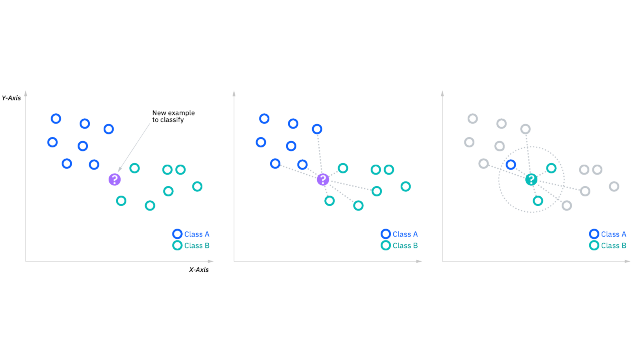

# Introduction
Since the 1980s, economists have argued about the predicting power of the slope of the yield curve - the spread between long and short term interest rate - on the U.S. economic activity. Based on this, many economists and research institution have built models trying to predict the economic activity of the U.S. One famous one is the U.S. Recession Probability Model created by __Federal Reserve Bank of New York__ using Probit. This report will combine the idea of the Probit and some tradition machine learning methods on predicting the U.S. Recession.

The slope of yield curve should be an excellent indicator of future economic events for this reason:

* Current monetary policy has a significant influence on the yield curve and the economic activity. A rise of short-term rate tends to flatten the yield curve and the real economic growth. 

In this report, a few other financial indicators will be included for analysis. One being stock prices. Finance theory suggests that stock prices are determined by expectations about future dividend streams, which is tightly related to the future state economy. Money supply (M0, M1, M2, M3) will also be included in the analysis since it's tightly connected to credit market which is connected to the expectations for the future economy. A few other financial variables will also be included. 

***
# Methodology
In this report, three methods will be used for analyzing and predicting the future economic state of the U.S.

* Probit
* K Nearnest Neighbors
* Decision Tree Methods

We will going deeper for each one at its corresponding analysis page. Since we are predicting whether the U.S. will have recession in the future, we will be using indicator variable here: 1 being "in recession" and 0 being "not in recession" for specific period of time. 
```{r setup, include=FALSE}
knitr::opts_chunk$set(echo = TRUE)
```


```{r message=FALSE, include=FALSE}

options(warn = -1)
library(tidyverse)
library(corrplot)
library(tinytex)
library(ggplot2)
library(tidyr)
library(dplyr)
library(plotly)
library(readxl)
library(magrittr)
library(class)
library(MASS)
library(tree)
library(randomForest)
library(gbm)
library(BART)
library(leaps)
library(glmnet)
library(caret)

```

___

# Data Descriptions
* __spread__ : Term spread from the difference between 10-year and 3-month Treasury rates.(Monetary Policy has huge influence on both yield curve and real economic activity)
* __sp500__: S&P 500 index.(Future dividend streams)
* __cpi__: Consumer Price Index.
* __m0__: Monetary Base.(Monetary Base and M1, M2, M3 forms opinions on future credit market)
* __m1__: M1
* __m2__: M2
* __m3__: M3
* __unem_rate__: Unemployment Rate
* __new_private_house__: New Privately Own Housing Units
* __consumer_senti__: University of Michigan Consumer Sentiment
* __real_gdp__: Real GDP Growth
* __vendor_performance__: Vendor Performance
```{r, include=FALSE}
spread <- read_excel("allmonth.xls")

sp500 <- read.csv("sp500.csv") %>%
  set_colnames(c("date", "sp500_value"))

##Monetary Aggregates:
cpi <- read.csv("cpi.csv") %>%
  set_colnames(c("date", "cpi"))

monetary_base <- read.csv("monetary_base.csv")%>%
  set_colnames(c("date", "monetary_base"))

m1 <- read.csv("m1_monthly.csv")%>%
  set_colnames(c("date", "m1"))

m2 <- read.csv("m2_monthly.csv")%>%
  set_colnames(c("date", "m2"))

m3 <- read.csv("m3_monthly.csv")%>%
  set_colnames(c("date", "m3"))

##NEw 
t10_t2 <- read.csv("T10Y2YM.csv")%>%
  set_colnames(c("date", "t10_t2"))

federal_funds <- read.csv("federal_funds.csv")%>%
  set_colnames(c("date", "fed_funds"))

unem_rate <- read.csv("unemployment_rate.csv")%>%
  set_colnames(c("date", "unem_rate"))

labor_rate <- read.csv("labor_force_participation_rate.csv")%>%
  set_colnames(c("date", "labor_rate"))

new_private_house <- read.csv("new_privately_owned_housing_units.csv")%>%
  set_colnames(c("date", "new_house"))

consumer_senti <- read.csv("um_consumer_sentiment.csv")%>%
  set_colnames(c("date", "consumer_senti"))

real_gdp <- read.csv("real_gdp.csv")%>%
  set_colnames(c("date", "real_gdp"))

vendor_performance <- read.csv("vendor_performance.csv")%>%
  set_colnames(c("date", "vp"))


```


## Manipulate the data
Since some data such as real gdp, money aggregate, cpi etc. are posted in lag or on a quarterly basis. All the data have been adjusted to indicate the most up-to-date information that we have at the analysis at each time period. 
```{r, include=FALSE}
## Change to %Y-%M format
spread$year_month <- format(as.Date(spread$Date), "%Y-%m")
sp500$year_month <- format(as.Date(sp500$date), "%Y-%m")
cpi$year_month <- format(as.Date(cpi$date), "%Y-%m")
monetary_base$year_month <- format(as.Date(monetary_base$date), "%Y-%m")
m1$year_month <- format(as.Date(m1$date), "%Y-%m")
m2$year_month <- format(as.Date(m2$date), "%Y-%m")
m3$year_month <- format(as.Date(m3$date), "%Y-%m")
t10_t2$year_month <- format(as.Date(t10_t2$date), "%Y-%m")
federal_funds$year_month <- format(strptime(federal_funds$date, "%m/%d/%Y"), "%Y-%m")
unem_rate$year_month <- format(strptime(unem_rate$date, "%m/%d/%Y"), "%Y-%m")
labor_rate$year_month <- format(strptime(labor_rate$date, "%m/%d/%Y"), "%Y-%m")
new_private_house$year_month <- format(strptime(new_private_house$date, "%m/%d/%Y"), "%Y-%m")
consumer_senti$year_month <- format(strptime(consumer_senti$date, "%m/%d/%Y"), "%Y-%m")
```

```{r, include=FALSE}
monetary_aggregate <- merge(cpi, monetary_base, by = 'year_month')%>%
  merge(m1, by = 'year_month')%>%
  merge(m2, by = 'year_month')%>%
  merge(m3, by = 'year_month')%>%
  set_colnames(c("year_month", "1", "cpi", "2", "m0", "3", "m1", "4", "m2", "5", "m3"))%>%
  dplyr::select(-c("1", "2", "3", "4", "5"))

deflated_m0 <- monetary_aggregate$m0 / monetary_aggregate$cpi
deflated_m1 <- monetary_aggregate$m1 / monetary_aggregate$cpi
deflated_m2 <- monetary_aggregate$m2 / monetary_aggregate$cpi
deflated_m3 <- monetary_aggregate$m3 / monetary_aggregate$cpi
monetary_aggregate$year_month <- lead(monetary_aggregate$year_month, 1)

monetary_aggregate <- cbind(monetary_aggregate, deflated_m0, deflated_m1, deflated_m2, deflated_m3)
```

```{r, include=FALSE}
real_gdp <- real_gdp%>%
  mutate(real_gdp = real_gdp/lag(real_gdp, 1) -1)

real_gdp <- cbind(real_gdp, rep(3, nrow(real_gdp)))%>%
  set_colnames(c("date", "real_gdp", "rep_times"))

months <- c(rep(1:12, round(nrow(real_gdp)/4)), 1:6)

monthly_real_gdp <- data.frame(lapply(real_gdp, rep, real_gdp$rep_times))%>%
  cbind(months)

year_month <- as.Date(paste0(substr(monthly_real_gdp$date, 1, 4), "-", monthly_real_gdp$months, "-", "01"))%>%
  format("%Y-%m")

monthly_real_gdp <- cbind(monthly_real_gdp, year_month)%>%
  dplyr::select(c("real_gdp", "year_month"))%>%
  mutate(real_gdp = lag(real_gdp,3))%>%
  na.omit()

```


```{r, include=FALSE}


recession_data <- merge(spread, sp500, by = "year_month")%>%
  merge(monetary_aggregate, by = "year_month")%>%
  merge(monthly_real_gdp, by = "year_month")%>%
  merge(consumer_senti[,2:3], by = "year_month")%>%
  merge(labor_rate[,2:3], by = "year_month")%>%
  merge(unem_rate[,2:3], by = "year_month")%>%
  merge(federal_funds[,2:3], by = "year_month")%>%
  merge(new_private_house[,2:3], by = "year_month")%>%
  dplyr::select(-c("Date", "date"))%>%
  set_colnames(c("year_month", "t_10_y", "t_3_m","t_3_m_cash", "spread", "fed_rec_prob", "nber_rec", "sp500", "cpi", "m0", "m1", "m2", "m3", "deflated_m0", "deflated_m1", "deflated_m2", "deflated_m3", "real_gdp", "consumer_senti", "labor_rate", "unem_rate", "fed_funds", "new_private_house"))


## Add one_year and one_and_half_year forward recession
one_year_rec <- rep(NA, nrow(recession_data))
one_half_year_rec <- rep(NA, nrow(recession_data))

for (i in 1:(nrow(recession_data)-16)) {
  start_year <- i + 1
  end_year <- i + 12
  
  recesion_in_next_one_year <- sum(recession_data$nber_rec[start_year:end_year])
  
  if(recesion_in_next_one_year > 0){
    one_year_rec[i] <- 1
  } else {
    one_year_rec[i] <- 0
  }
}

for (i in 1:(nrow(recession_data)-22)) {
  start_year <- i + 1
  end_year <- i + 18
  
  recesion_in_next_one_half_year <- sum(recession_data$nber_rec[start_year:end_year])
  
  if(recesion_in_next_one_half_year > 0){
    one_half_year_rec[i] <- 1
  } else {
    one_half_year_rec[i] <- 0
  }
}

recession_data <- cbind(recession_data, one_year_rec) %>%
  cbind(one_half_year_rec)%>%
  na.omit()

```


## Feature Selection
Since we are using many variables, feature selection is performed in this case to select optimal set of variable to be used in the final analysis:

* Correlation Matrix is being used here to see the correlation coefficients between every two variables.
* Best Subset Selection

__Correlation Matrix:__

The following 12 varibales are being used for feature selection: spread, sp500, cpi, consumer_senti, unem_rate, fed_funds, new_private_house, deflated_m0, deflated m1, deflated m2, deflated m3, real_gdp.

Through the correlation matrix, we notice that deflated m0, deflated m1, deflated m2, deflated m3, cpi and sp500 correlate with each other. By eliminating deflated m0, deflated m1 and deflated m2. We get the updated correlation matrix. 
```{r,fig.align='center'}
correlation_matrix <- cor(
  recession_data%>%
    dplyr::select(c( "spread", 
                     "sp500", 
                     "cpi",
                     "real_gdp", 
                     "consumer_senti", 
                     "new_private_house", 
                     "labor_rate", 
                     "unem_rate", 
                     "fed_funds",
                     "deflated_m0",
                     "deflated_m1",
                     "deflated_m2",
                     "deflated_m3"
                     ))
)

corrplot(correlation_matrix)

updated_correlation_matrix <- cor(
  recession_data%>%
    dplyr::select(c( "spread", 
                     "sp500", 
                     "cpi",
                     "real_gdp", 
                     "consumer_senti", 
                     "new_private_house", 
                     "labor_rate", 
                     "unem_rate", 
                     "fed_funds",
                     "deflated_m3"
                     ))
)

corrplot(updated_correlation_matrix)

```

__Best Subset Selection:__ 

The following 12 varibales are being used for feature selection: spread, sp500, cpi, consumer_senti, unem_rate, fed_funds, new_private_house, deflated_m0, deflated m1, deflated m2, deflated m3, real_gdp.

By performing best subset selection in this case, we noticed that the best model is the one with 10 variable by using Adjusted R-Square. The following variable is being selected: spread, sp500, consumer_senti, unem_rate, fed_funds, new_private_house, deflated m0, deflated m1, deflated m3, real_gdp
```{r, fig.align='center'}
subset_full <- regsubsets(one_year_rec ~ spread + sp500 + cpi + consumer_senti + unem_rate + fed_funds + new_private_house + deflated_m0 + deflated_m3 + real_gdp + deflated_m1 + deflated_m2, recession_data, nvmax = 12)
subset_summary <- summary(subset_full)
subset_result <- cbind(1:12,subset_summary$adjr2)%>%
  as.data.frame()

ggplot(subset_result, aes(x = V1, y = V2)) + 
   geom_point(size = 1.5, alpha = 0.5, color = "blue") + 
   theme_bw() + 
   ggtitle("Best Subset Selection against Adjusted R-Square") + 
   xlab("Number of Variables") +
   ylab("Adjusted R-Square") +
   annotate("pointrange", x = 10, y = 0.4161428, ymin = 0.38, ymax = 0.45, size = 1, alpha = 0.3, color = "red")
```


___
# Probit
## Probit Regression Model Descriptions:
__Probit Regression__ is a traditional econometrics regression model where the dependent variable is binary which only takes two values (indicator variables). In our case, we take two values 1 being "in recession" and 0 being "not in recession". Probit Regression Model is estimated through Maximum Likelihood Procedure. 

Probit Regression Model takes the following form: 

$P(Y=1|X) = \phi(X^T\beta)$ where $\phi$ is the cumulative distribution function. 

In the probit regression model, a latent variable is being introduced. 

$Y^* = X^T\beta + \epsilon$ and $Y = 1[Y^* \geq0]$

Based on above, 

$P(Y=1|X) = P(1[Y^*\geq 0]) = P(Y^*\geq0|X) = P(X^T\beta + \epsilon \geq0|X)$

To calculate the Probability of $P(X^T\beta + \epsilon \geq0|X)$, Assuming the $\epsilon$ belongs to a Normal Distribution, then we have the following:

$P(\epsilon \geq -X^T\beta|X)$ which equals to $\phi(X^T\beta)$
```{r}
one_year_probit <- glm(one_year_rec ~ spread + sp500 + consumer_senti + unem_rate + fed_funds + new_private_house + deflated_m0 + deflated_m3 + real_gdp + deflated_m1, data = recession_data, family = binomial(link = "probit"))

one_half_year_probit <- glm(one_half_year_rec ~ spread + sp500 + consumer_senti + unem_rate + fed_funds + new_private_house + deflated_m0 + deflated_m3 + real_gdp + deflated_m1, data = recession_data, family = binomial(link = "probit"))

one_year_rec_prob <- predict(one_year_probit, type = "response")
one_half_year_rec_prob <- predict(one_half_year_probit, type = "response")

rec_prob <- cbind(recession_data$year_month, recession_data$fed_rec_prob) %>%
  cbind(one_year_rec_prob) %>%
  cbind(one_half_year_probit) %>%
  set_colnames(c("year_month", "fed_rec_prob", "one_year_rec_prob", "one_half_year_probit"))%>%
  as.data.frame() %>%
  mutate(year_month = as.Date(paste(year_month, "-01", sep = ""))) %>%
  mutate(fed_rec_prob = as.numeric(fed_rec_prob))%>%
  mutate(one_year_rec_prob = as.numeric(one_year_rec_prob))%>%
  mutate(one_half_year_rec_prob = as.numeric(one_half_year_rec_prob))


```


## Probit Model Visulation
```{r,fig.align='center'}
## One Year Probability Vs. Fed Probability
ggplot(data = rec_prob, aes(x = year_month)) +
  geom_line(aes( y = one_year_rec_prob), color = "red")+
  geom_rect(aes(xmin = as.Date("1960-05-01"), xmax = as.Date("1961-02-01"), ymin = 0, ymax = 1), fill = "blue", alpha = 0.002)+
  geom_rect(aes(xmin = as.Date("1970-01-01"), xmax = as.Date("1970-11-01"), ymin = 0, ymax = 1), fill = "blue", alpha = 0.002)+
  geom_rect(aes(xmin = as.Date("1973-12-01"), xmax = as.Date("1975-03-01"), ymin = 0, ymax = 1), fill = "blue", alpha = 0.002)+
  geom_rect(aes(xmin = as.Date("1980-02-01"), xmax = as.Date("1980-07-01"), ymin = 0, ymax = 1), fill = "blue", alpha = 0.002)+
  geom_rect(aes(xmin = as.Date("1981-08-01"), xmax = as.Date("1982-11-01"), ymin = 0, ymax = 1), fill = "blue", alpha = 0.002)+
  geom_rect(aes(xmin = as.Date("1990-08-01"), xmax = as.Date("1991-03-01"), ymin = 0, ymax = 1), fill = "blue", alpha = 0.002)+
  geom_rect(aes(xmin = as.Date("2001-04-01"), xmax = as.Date("2001-11-01"), ymin = 0, ymax = 1), fill = "blue", alpha = 0.002)+
  geom_rect(aes(xmin = as.Date("2008-01-01"), xmax = as.Date("2009-06-01"), ymin = 0, ymax = 1), fill = "blue", alpha = 0.002)+
  geom_rect(aes(xmin = as.Date("2020-03-01"), xmax = as.Date("2020-04-01"), ymin = 0, ymax = 1), fill = "blue", alpha = 0.002)+
  theme_bw() +
  theme(legend.position = "bottom")+
  ggtitle("One Year Probability", subtitle = "Red: One Year Probability;  Blue: NBER Recession") +
  xlab("Year - Month") +
  ylab("Recession Probability")
```


```{r,fig.align='center'}
## One and Half Year Probability Vs. Fed Probability
ggplot(data = rec_prob, aes(x = year_month)) +
  geom_line(aes( y = fed_rec_prob), color = "blue") +
  geom_line(aes( y = one_year_rec_prob), color = "red")+
  theme_bw() +
  theme(legend.position = "bottom")+
  ggtitle("One and Half year Probability Vs. Fed Probability", subtitle = "Red: One and Half year Probability;  Blue: Fed Probability") +
  xlab("Year - Month") +
  ylab("Recession Probability")

```
 

___
# K-Nearest Neighbors
## K-Nearest Neighbors Descriptions:
K-Nearest Neighbors is machine learning classifier, which uses proximity to make classification about the groupings of individual data points. The following graphs shows intuitively how KNN works.

When using KNN for classification problem, a classification label is assigned on the basis of a majority vote from the nearest neighbors(The label that is most frequently represented around a given data point(target data point)). Therefore, one goal of the K-nearest neighbors algorithm is to identify the nearest neighbors of a given point. In order to find the nearest neighbors, we need determine the distance metrics to calculate the distance.In this case, we are using __Euclidean Distance__, which is calculated in the following approach:

$Distance(X, Y) = \sqrt{\Sigma(Y_i - X_i)^2}$

By finding the nearest k number of neighbors using the Euclidean Distance, we are able to find the majority vote from them and make the corresponding classification. 

__Creating Training and Test Set__:
For machine learning model, we divided data into two parts, one being the training set which will be used to train the model and tune the parameter and the other being the test set which will be used to test the prediction accuracy. In this case, 2/3 of total observations will be used in the training set while the left 1/3 will be used in the test set. 
```{r}
training <- sample(1:nrow(recession_data), nrow(recession_data)*(2/3))
training_set <- recession_data[training,]
test_set <- recession_data[-training,]
```


```{r}

features <- c(names(recession_data)[2:5], names(recession_data)[8:23])
train_x <- training_set[,features]
test_x <- test_set[,features]
train_oneyear_y <- training_set[, "one_year_rec"]
train_onehalfyear_y <- training_set[, "one_half_year_rec"]

set.seed(123)

## One year recession prediction
one_year_knn_pred <- knn(train_x, test_x, train_oneyear_y, k = 4)
confusionMatrix(data = factor(one_year_knn_pred),reference = factor(test_set[, "one_year_rec"]))
```
__Cross Validation:__ In order to gain the optimal prediction accuracy, we need to find what will be the optimal K (# of neighbors to be considered) in this case. In this case, we use number 1 to 20 for K and to see which test accuracy is the highest and choose the the K with highest prediction accuracy. In this case, we are choosing K = 4. 

After tuning the parameter K to be 4, The KNN model gives a test (out-of-sample) accuracy of 98.0392%. 

```{r}
# Cross Validating K
set.seed(123)
correct_ratio <- rep(0,20)
for (i in 1:20) {
  one_year_knn_pred <- knn(train_x, test_x, train_oneyear_y, k = i)
  correct_ratio[i] <- mean(one_year_knn_pred == test_set[, "one_year_rec"])
}

correct_ratio <-  as.data.frame(t(as_data_frame(rbind(1:20,correct_ratio))))%>%
  set_colnames(c("k", "accuracy"))

ggplot(correct_ratio, aes(x = k, y = accuracy)) +
  geom_point(size = 1.5, alpha = 0.5, color = "blue") +
  theme_bw() +
  ggtitle("One Year Prediction Accuracy Vs. K") +
  xlab("K") +
  ylab("Accuracy")
```
```{r}
## One and half year recession prediction
one_half_year_knn_pred <- knn(train_x, test_x, train_onehalfyear_y, k = 6)
table(one_half_year_knn_pred, test_set[, "one_half_year_rec"])
mean(one_half_year_knn_pred == test_set[, "one_half_year_rec"])
```

```{r}
set.seed(123)
# Cross Validating K
correct_ratio <- rep(0,20)
for (i in 1:20) {
  one_half_year_knn_pred <- knn(train_x, test_x, train_onehalfyear_y, k = i)
  correct_ratio[i] <- mean(one_half_year_knn_pred == test_set[, "one_half_year_rec"])
}

correct_ratio <-  as.data.frame(t(as_data_frame(rbind(1:20,correct_ratio))))%>%
  set_colnames(c("k", "accuracy"))

ggplot(correct_ratio, aes(x = k, y = accuracy)) +
  geom_point(size = 1.5, alpha = 0.5, color = "blue") +
  theme_bw() +
  ggtitle("One Year Prediction Accuracy Vs. K") +
  xlab("K") +
  ylab("Accuracy")

```
__Cross-Validating K for One Year Recession Prediction__: This part goes through 1 to 20 in K and compare the out-of-sample prediction accuracy to select optimal K.

```{r}
## Create KNN Graph
test_graph <- data.frame(test_set, one_year_knn_pred)
test_graph$correct <- test_graph$one_year_knn_pred == as.character(test_graph$one_year_rec)
test_graph$correct[test_graph$correct == "TRUE"] <- ""

ggplot(test_graph, aes(y = spread, x = m3, col = one_year_knn_pred, label = correct)) +
  geom_point(size = 1.5, alpha = 0.2) +
  geom_point(data = subset(test_graph, correct = FALSE),
             aes(y = spread, x = m3, col = one_year_knn_pred, label = correct),
             size = 1, alpha = 0.8)+
  theme_bw() +
  theme(legend.position = "bottom") +
  ggtitle("Prediction Results") +
  geom_text(size = 2, show.legend = FALSE)+
  xlim(min(test_graph$m3), max(test_graph$m3)) +
  ylim(min(test_graph$spread), max(test_graph$spread))


ggplot(test_graph, aes(y = spread, x = cpi, col = one_year_knn_pred, label = correct)) +
  geom_point(size = 1.5, alpha = 0.2) +
  geom_point(data = subset(test_graph, correct = FALSE),
             aes(y = spread, x = m3, col = one_year_knn_pred, label = correct),
             size = 1, alpha = 0.8)+
  theme_bw() +
  theme(legend.position = "bottom") +
  ggtitle("Prediction Results") +
  geom_text(size = 2, show.legend = FALSE)+
  xlim(min(test_graph$cpi), max(test_graph$cpi)) +
  ylim(min(test_graph$spread), max(test_graph$spread))


```
__KNN Visualization__: KNN graph is shown here in two dimension chart (might be more insight to see it in three and higher dimension)

___

# Tree Method

```{r}
tree_fit <- tree(as.factor(one_year_rec) ~ spread + sp500 + consumer_senti + unem_rate + fed_funds + new_private_house + deflated_m0 + deflated_m3 + real_gdp + deflated_m1, data = training_set)
tree_pred <- predict(tree_fit,test_set, type = "class")
table(tree_pred, test_set$one_year_rec)
mean(tree_pred == test_set$one_year_rec)
```
One and Half Year Recession Prediction Confusion Matrix as Above

One and Half Year Recession Prediction Accuracy as Above

```{r}
plot(tree_fit)
text(tree_fit, pretty = 0)
```
__Tree Visualization__: Visualization of the decision tree above.
```{r,fig.align='center'}
# Conducting CV
set.seed(1)
cv_tree_fit <- cv.tree(tree_fit, FUN = prune.misclass)
cv_result <- data.frame(cv_tree_fit$size, cv_tree_fit$k, cv_tree_fit$dev)%>%
  set_colnames(c("size", "k", "dev"))

ggplot(cv_result, aes(x = size, y = dev)) +
  geom_point(size = 1.5, alpha = 0.5) +
  theme_bw()
```
__Cross-Validating for Optimal Size of the Tree__: This graph go through the tree size against the error rate.
```{r,fig.align='center'}
ggplot(cv_result, aes(x = k, y = dev)) +
  geom_point(size = 1.5, alpha = 0.5) +
  theme_bw()
```
__Cross-Validating for Optimal alpha__: This graph go through the alpha (tuning parameter for prune tree) against the error rate.
```{r}
prune_tree <- prune.tree(tree_fit, best = 13)
plot(prune_tree)
text(prune_tree, pretty = 0)

prune_tree_pred <- predict(prune_tree, test_set, type = "class")
table(prune_tree_pred, test_set$one_year_rec)
mean(prune_tree_pred == test_set$one_year_rec)
```

## Random Forest
```{r}
rf_fit <- randomForest(as.factor(one_year_rec) ~ spread + sp500 + consumer_senti + unem_rate + fed_funds + new_private_house + deflated_m0 + deflated_m3 + real_gdp + deflated_m1, data = training_set, mtry = 9, ntree = 100, importance = TRUE)
rf_pred <- predict(rf_fit, newdata = test_set)
table(rf_pred, test_set$one_year_rec)
mean(rf_pred == test_set$one_year_rec)


rf_fit <- randomForest(as.factor(one_year_rec) ~ spread + sp500 + consumer_senti + unem_rate + fed_funds + new_private_house + deflated_m0 + deflated_m3 + real_gdp + deflated_m1, data = training_set, mtry = 3, ntree = 100, importance = TRUE)
rf_pred <- predict(rf_fit, newdata = test_set)
table(rf_pred, test_set$one_year_rec)
mean(rf_pred == test_set$one_year_rec)
varImpPlot(rf_fit)
```
___
## Boosting
```{r}
set.seed(123)
boost_fit <- gbm(as.character(one_year_rec) ~ spread + sp500 + consumer_senti + unem_rate + fed_funds + new_private_house + deflated_m0 + deflated_m3 + real_gdp + deflated_m1, data = training_set, distribution = "bernoulli", n.trees = 1000, interaction.depth = 4)
boost_fit
boost_pred <- predict(boost_fit, newdata = test_set, n.trees = 1000)

```


##Test for Git
___
